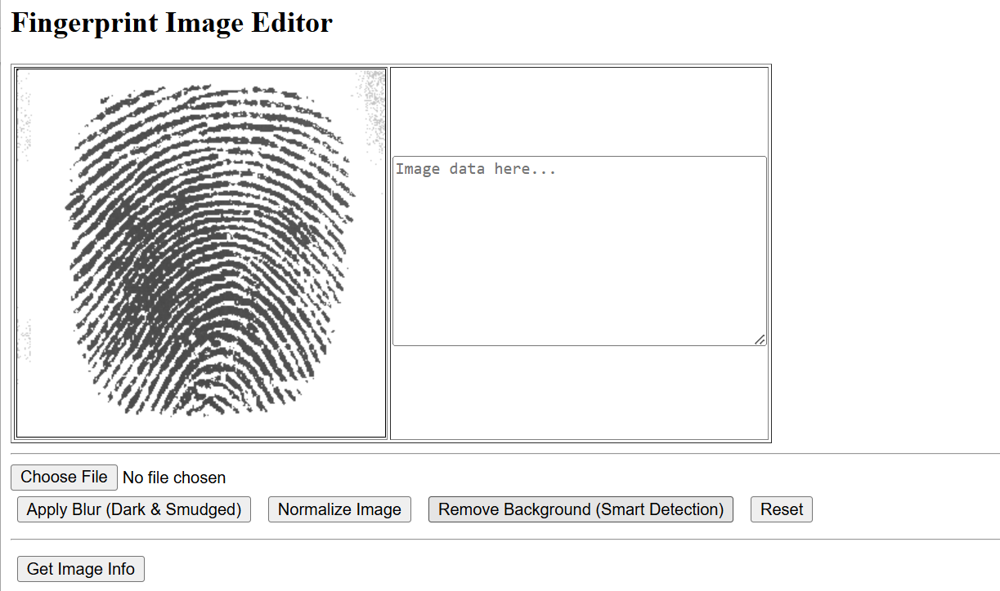
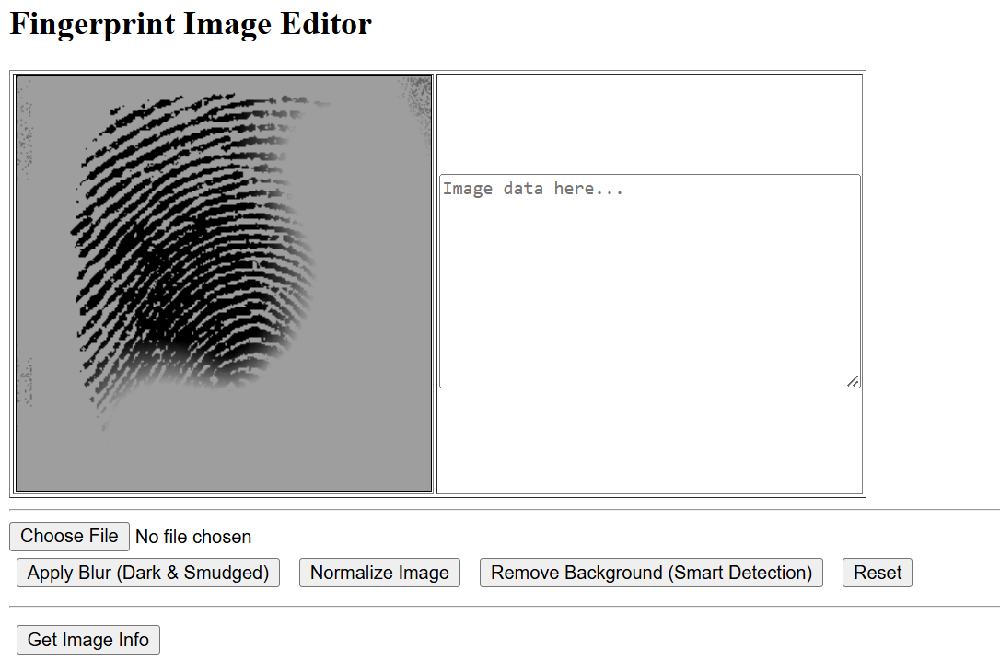
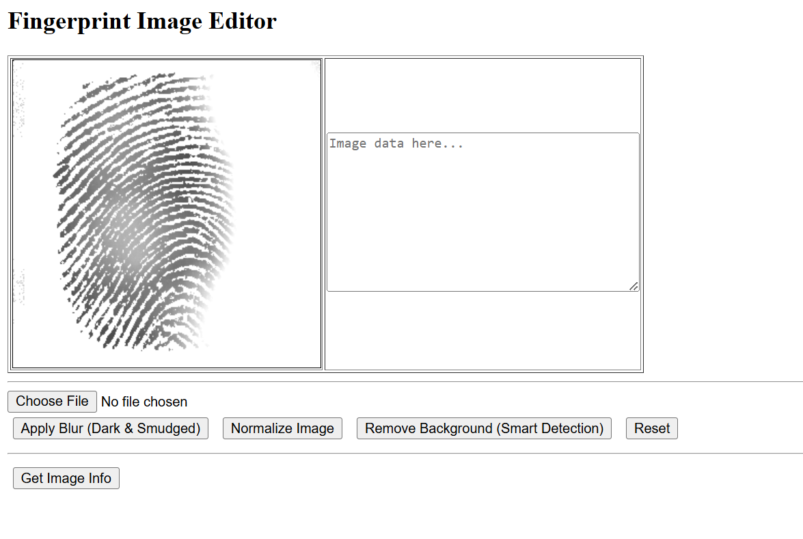
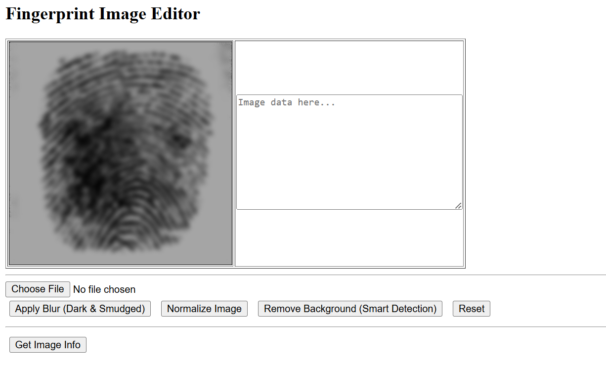

# REPO
https://github.com/mulefish/fingerprints

# Orig finger prints from: 
https://github.com/robertvazan/fingerprint-datasets   
Tip from a work buddy. 

# Web part dependencies: 
Have node, install express

# Python dependencies
import numpy as np  
import matplotlib.pyplot as plt   
from PIL import Image  
 
# Example image from a vectorized fingerprint

# Python: 
See fingerprint_v2.ipynb OR tiff_to_png.py for some of the logic. 

# HTML 5: 
See the javascript in index.html - it is a bunch of pixel manipulation code

# HTML 5 to derogate the finger prints: Some images : Goal : Make finger prints that look like how bad fingerprints look
Original

MissingParts

TooLight_AndWeird

Blurry

# TODO 2 
Train! 

# TODO 3
Make a AWS page/html to host it

