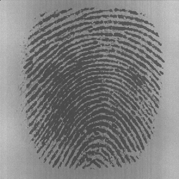

# REPO
https://github.com/mulefish/telos_fingerprints

# Orig finger prints from: 
https://github.com/robertvazan/fingerprint-datasets   
Tip from a work buddy. 

# Example image from a vectorized fingerprint

# TODO 1
Make some way to derogate the finger prints - Can not look for success w/o failures

# TODO 2 
Train! 

# TODO 3
Make a AWS page/html to host it

